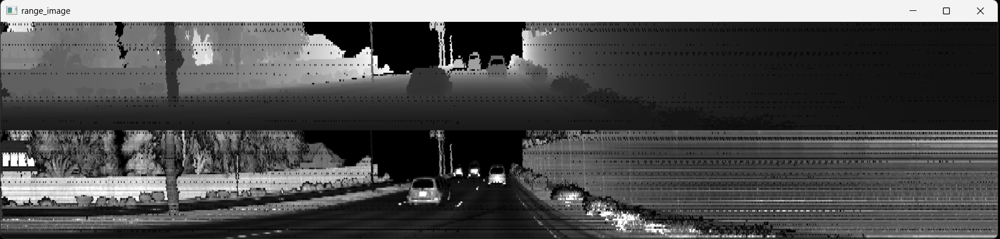
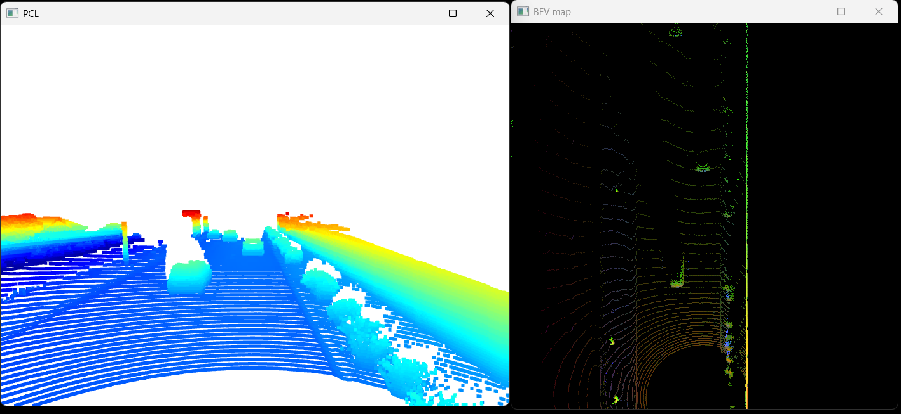
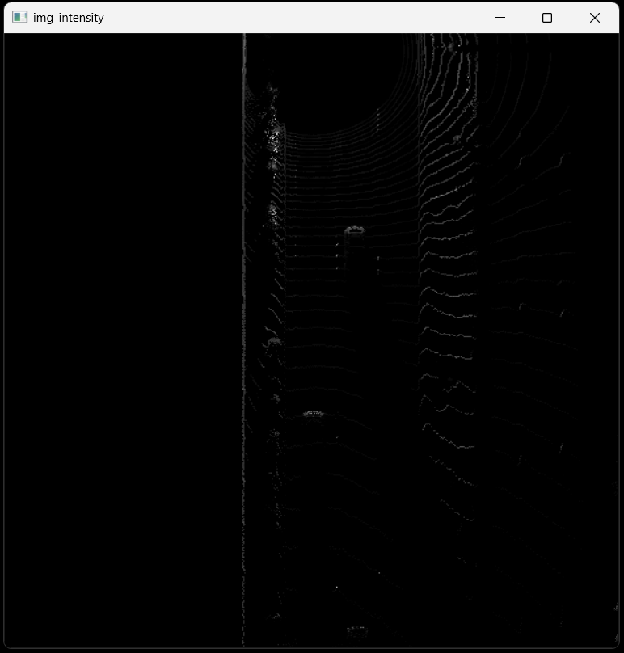
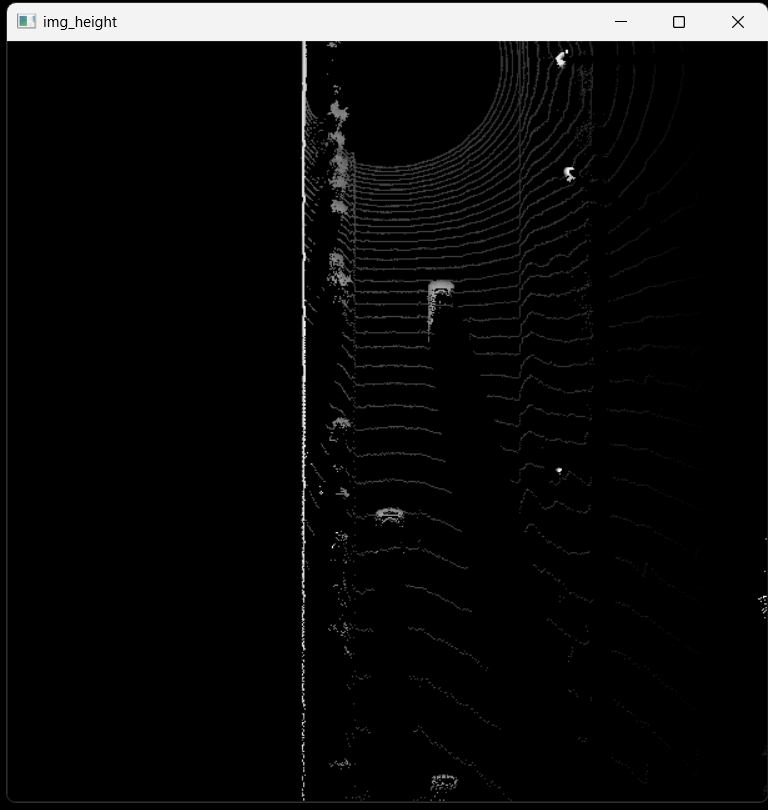
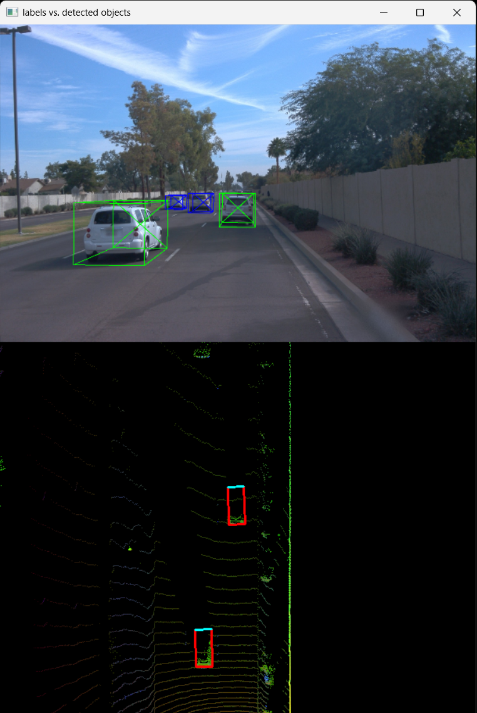
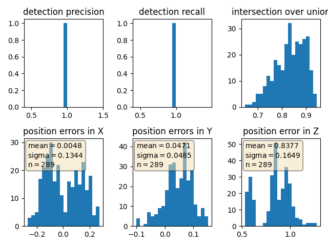

# Writeup: 3D Object Detection

Objective: detect vehicles from BEV lidar point clouds

#### 1: Visualize range image channels (ID_S1_EX1)

#### 2: Visualize point-cloud (ID_S1_EX2)
Within a write-up file (Markdown or PDF):
- Find 10 examples of vehicles with varying degrees of visibility in the point-cloud
- Try to identify vehicle features that appear stable in most of the inspected examples and describe them
- Zoom in and rotate the open3d display window on VM to capture the vehicle images

| | | |
|:-------------------------:|:-------------------------:|:-------------------------:|
| 1 |  2 |  3 |
| 4 |  5 |  6 |
| 7 |  8 | |

The above images show vehicles with varying degrees of visibility in the point-cloud. E.g image "3" shows a fully visible following vehicle, "2" shows a fully visible preceeding vehicle, "1" shows a partially visible vehicle which is partially inside lidar blind spot. Images "5" and "7" show different king of vehicles with trailers. Finally figure "8" shows an intersection including pedestrains. In general vehicles look like rectangles with a longer side and rounded corners. Depending on the view (if from the side) wheels are also clearly visible.

| | |
|:-------------------------:|:-------------------------:|
| | |
| | |

The most recognizable features of vehicles are rear bumpers, license plates, lights which are highly reflective. Windshelds/glass are instead very dark. Images often include other really bright points due to e.g road cones, lane markers and signs.

#### 3: Convert sensor coordinates to bev-map coordinates (ID_S2_EX1)

#### 4: Compute intensity layer of bev-map (ID_S2_EX2)

#### 5: Compute height layer of bev-map (ID_S2_EX3)

#### 6: Add a second model from a GitHub repo (ID_S3_EX1)
#### 7: Extract 3D bounding boxes from model response (ID_S3_EX2)

#### 8: Compute intersection-over-union (IOU) between labels and detections (ID_S4_EX1)
#### 9: Compute false-negatives and false-positives (ID_S4_EX2)
#### 10: Compute precision and recall (ID_S4_EX3)

